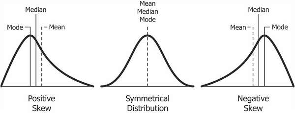
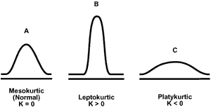

# День 3. Описательная статистика и визуализация {#vis}

##Описательная статистика {#desc}

Статистика делится на описательную статистику (descriptive statistics) и статистику вывода (inferential statistics). Описательная статистика пытается описать нашу выборку (sample, т.е. те данные, что у нас на руках) различными способами. Проблема в том, что описательная статистика может описать только то, что у нас есть, но не позволяет сделать выводы о генеральной совокупности (population) - это уже цель статистики вывода. Цель описательной статистики - "ужать" данные для их обобщенного понимания с помощью *статистик*. Заметьте, у выборки (**s**ample) мы считаем статистики (**s**tatistics), а у генеральной совокупности (**P**opulation) есть параметры (**P**arameters). Вот такая вот мнемотехника. 
Статистики часто выступают в роли *точечной оценки* (point estimators) параметров, так что в этом легко запутаться. Например, среднее (в выборке) - это оценка среднего (в популяции). Да, можно свихнуться. Мы это будем разбирать подробнее в следующие занятия (это действительно важно, поверьте), пока что остановимся только на описании выборки.


Сегодня мы будем работать с пакетом `survival`, в котором есть датасет `pbc`. Мы его сразу превратим в `data.table`

```{r}
library(survival)
library(data.table)

data(pbc)
pbcdt <- as.data.table(pbc)
```

Это данные 424 пациентов с первичным билиарным циррозом - редким аутоимунным заболеванием печени. При поступлении в клинику у них измерили разные медицинские показатели, определели в экспериментальную и контрольную группу. В наборе данных есть информация о том, что стало с этими испытуемыми.

> This data is from the Mayo Clinic trial in primary biliary cirrhosis (PBC) of the liver conducted between 1974 and 1984. A total of 424 PBC patients, referred to Mayo Clinic during that ten-year interval, met eligibility criteria for the randomized placebo controlled trial of the drug D-penicillamine. The first 312 cases in the data set participated in the randomized trial and contain largely complete data. 

Подробнее про датасет можно почитать [здесь](https://stat.ethz.ch/R-manual/R-devel/RHOME/library/survival/html/pbc.html) или в хэлпе

Эти данные часто используются в качестве примера для анализа выживаемости. Эти данные уже в достаточно упорядоченном виде и не нуждаются в предобработке (что, к сожалению, случай малореалистичный). Зато на этом
наборе данных можно 

Для простоты мы удалим все пропущенные значения. Мы уже знакомы с функцией `is.na()`, теперь познакомимся с еще одной функцией: `complete.cases()` возвращает вектор, равный длине датафрейма, с `FALSE` для строчек, где есть хотя бы один `NA`, и `TRUE` если пропущенных значений нет.

```{r}
pbcdt <- pbcdt[complete.cases(pbc),]
```

Пока что мы будем использовать только данные о возрасте испытуемых. Для краткости обозначим это вектором `a`

```{r}
a <- pbcdt$age
```

###Меры центральной тенденции {#cent_tend}

Мера центральной тенденции - это число для описания *центра* распределения. 

####Арифметическое среднее {#mean}
Самая распространенная мера центральных тенденций - арифметическое среднее, то самое, которые мы считаем с помощью функции mean()

$$\overline{x}= \frac{\sum\limits_{i=1}^{n} x_{i}} {n}$$

Не пугайтесь значка $$\sum\limits_{i=1}^{n}$$ - это означает сумму от i = 1 до n. Что-то вроде цикла `for`!  

В качестве упражнения попробуйте самостоятельно превратить эту формулу в функцию `mymean()` c помощью `sum()` и `length()`. Можете убирать NA по дефолту! Сравните с результатом функции `mean()`.  

```{r}
mean(a)
```


####Медиана {#median}

Медиана - это *середина* распределения. Представим, что мы расставили значения по порядку (от меньшего к большему) и взяли значение по середине. Если у нас четное количество значений, то берется среднее значение между теми двумя, что по середине. Для расчета медианы есть функция `median()`:  

```{r}
median(a)
```

Разница медианы со средним не очень существенная. Это значит, что распределение довольно "симметричное". Но бывает и по-другому.

Представьте себе, что кто-то говорит про среднюю зарплату в Москве. Но ведь эта средняя зарплата становится гораздо больше, если учитывать относительно небольшое количество мультимиллионеров и миллиардеров! А вот медианная зарплата будет гораздо меньше.  

Представьте себе, что в эту клинику с циррозом печени пришел 8000-летний Король Ночи из Игры Престолов. Тогда арифметическое среднее станет гораздо больше:

```{r}
mean(c(a, 8000))
```

А вот медиана останется почти той же.

```{r}
median(c(a, 8000))
```

Таким образом, экстремально большие или маленькие значения оказывают сильное влияние на арифметическое среднее, но не на медиану. Поэтому медиана считается более "робастной" оценкой, т.е. более устойчивой к выбросам и крайним значениям.  

####Усеченное среднее (trimmed mean)  {#trim}

Если про среднее и медиану слышали все, то про усеченное (тримленное) среднее известно гораздо меньше. Тем не менее, на практике это довольно удобная штука, потому что представляет собой некий компромисс между арифметическим средним и медианой.  

В усеченном среднем значения ранжируются так же, как и для медианы, но отбрасывается только какой-то процент крайних значений. Усеченное среднее можно посчитать с помощью обычной функции mean(), поставив нужное значение параметра `trim =`:  

```{r}
mean(a, trim = 0.1)
```

`trim = 0.1` означает, что мы отбросили 10% слева и 10% справа. `trim` может принимать значения от 0 до 0.5. Что будет, если `trim = 0`?  

```{r}
mean(a, trim = 0)
```

Обычное арифметическое среднее! А если `trim = 0.5`?  

```{r}
mean(a, trim = 0.5)
```

Медиана!

####Мода {#mode}

Мода (mode) - это самое *частое* значение. Обычно используется для номинальных переменных. Например, можно посчитать моду для регионов, в которых происходили битвы. Что интересно, в R нет встроенной функции для подсчета моды. Обычно она и не нужна: мы можем посчитать таблицу частот и даже проранжировать ее (и мы уже умеем это делать разными способами). На случай если Вы все-таки хотите создать свою функцию для моды, можно попробовать что-то такое:  

```{r}
mymode <- function(x){names(which.max(table(x)))}
mymode(pbcdt$sex)
```

###Меры рассеяния  {#vary}

> Статистик пытался перейти в брод реку, средняя глубина которой 1 метр. И утонул.  
> В чем была его ошибка? Он не учитывал разброс значений глубины!  

Мер центральной тенденции недостаточно, чтобы описать выборку. Необходимо знать ее вариабельность.  

####Размах {range}

Самое очевидное - посчитать размах (range), то есть разницу между минимальным и максимальным значением. В R есть функция для вывода максимального и минимального значений:  

```{r}
range(a)
```

Осталось посчитать разницу между ними:  

```{r}
diff(range(a))
```

Естественно, крайние значения очень сильно влияют на этот размах, поэтому на практике он не очень-то используется.  

####Дисперсия  {#var}

Дисперсия (variance) вычисляется по следующей формуле:  


$$s^2= \frac{\sum\limits_{i=1}^{n} (x_{i} - \overline{x})^2} {n}$$


Попробуйте превратить это в функцию `myvar()`!

```{r}
myvar <- function(x) mean((x - mean(x))^2)
```

Естественно, в R уже есть готовая функция `var()`. Но, заметьте, ее результат немного отличается от нашего:  

```{r}
myvar(a)
var(a)
```

Дело в том, что встроенная функция var() делит не на $n$, а на $n-1$. Это связано с тем, что эта функция пытается оценить дисперсию в генеральной совокупности, т.е. относится уже к статистике вывода. Про это мы будем говорить в дальнейших занятиях, сейчас нам нужно только отметить то, что здесь есть небольшое различие.  

####Стандартное отклонение  {#sd}

Если вы заметили, значение дисперсии очень большое. Чтобы вернуться к единицам измерения, соответствующих нашим данным используется корень из дисперсии, то есть стандартное отклонение (standard deviation):  


$$s= \sqrt\frac{\sum\limits_{i=1}^{n} (x_{i} - \overline{x})^2} {n}$$


Для этого есть функция sd():

```{r}
sd(a)
```

Что то же самое, что и:  

```{r}
sqrt(var(a))
```

####Медианное абсолютное отклонение  {#mad}

Поскольку стандартное отклонение не устойчово ко всяким выбросам, то иногда используют его альтернативу, которая устойчива к выбросам (особенно если эти выбросы нам как раз и нужно удалить) - медианное абсолютное отклонение (median absolute deviation):


$$mad= median(|x_{i} - median(x)|)$$


Для этого есть функция `mad()`:

```{r}
mad(a)
```

####Межквартильный размах {#iqr}

Другой вариант рабостной оценки вариабельности данных является межквартильный размах (interquartile range = IQR). Это разница между третьим и первым квартилем - значением, которое больше 75% значений в выборке, и значением, которое больше 25% значений в выборке. 

```{r}
IQR(a)
```

> Ну а второй квартиль - это медиана!  

###Ассиметрия и эксцесс {#skku}

####Ассиметрия  {#skew}
Ассиметрия (skewness) измеряет симметричность распределения. Положительный показатель ассиметрии ("Right-skewed" или positive skewness) означает, что хвосты с правой части распределения длиннее. Негативный показатель ассиметрии ("Left-skewed" или negative skewness) означает, что левый хвост длиннее.  



> Например, в психологии положительная ассиметрия встречается очень часто. Например, время реакции: оно ограничено снизу 0 мс (а по факту не меньше 100 мс - быстрее сигнал не успеет по нервной системе пройти до пальцев), а вот с другой стороны оно никак не ограничено. Испытуемый может на полчаса перед монитором затупить, ага.  

####Эксцесс  {#kurtosis}

Эксцесс (kurtosis) - это мера "вытянутости" распределения:



Положительные показатели эксцесса означают "вытянутое" распределение, а отрицательные - "плоское".

####Ассиметрия и эксцесс в R  {#skewR}

К сожалению, в базовом R нет функций для ассиметрии и эксцесса. Зато есть замечательный пакет `psych` (да-да, специально для психологов).  

```{r, eval = FALSE}
install.packages("psych")
```

```{r}
library("psych")
```

В нем есть функции `skew()` и `kurtosi()`:

```{r}
skew(a)
kurtosi(a)
```

Ассиметрия близка к нулю - значит распределение выборки достаточно симметричное, а эксцесс немного ниже нуля - значит распределение довольно "плоское".

###А теперь все вместе!  {#summary}

В базовом R есть функция `summary()`, которая позволяет получить сразу неплохой набор описательных статистик.

```{r}
summary(a)
```

> Функция summary() - это универсальная (generic) функция. Это означает, что Вы можете ее применять для разных объектов и получать разные результаты. Попробуйте применить ее к векторам с разными типами данных и даже к дата.фреймам и дата.тейблам. Посмотрите, что получится.   

В пакете `psych` есть еще и замечательная функция `describe()`, которая даст Вам еще больше статистик, включая ассиметрию и куртозис:  

```{r}
describe(a)
```

Даже усеченное (trimmed) среднее есть (с `trim = 0.1`)! Все кроме `se` мы уже знаем. А про этот `se` узнаем через позже.  

Эта функция прекрасно работает в `data.table` в сочетании с `by=`:  

```{r}
pbcdt[, describe(age), by = stage]
```

###Описательных статистик недостаточно {#datasaurus} 

```{r, echo = FALSE}
xxx <- fread("data/d.csv")
```

Я в тайне от Вас загрузил данные в переменную `xxx`. Выглядят они примерно так:

```{r}
head(xxx)
str(xxx)
```

Надеюсь, Вы уже понимаете, как это интерпретировать - два столбца с 142 числами каждый. Представьте себе, как выглядят эти точки на плоскости, если каждая строчка означают координаты одной точки по осям x и y (это называется диаграмма рассеяния, точечная диаграмма или scatterplot).  

```{r echo = FALSE}
library(ggplot2)

ggplot(xxx, aes(x = x, y = y))+
  coord_fixed()+
  xlim(0, 100)+
  ylim(0, 100)+
  labs(title = "Представьте точки здесь:")
```

Применим разные функции, которые мы выучили:  

```{r}
mean(xxx$x)
mean(xxx$y)
median(xxx$x)
median(xxx$y)
```

Средние и медианы примерно одинаковые, при этом по х они около 53-54, а по у - примерно 46-47. Попытайтесь представить это. Идем дальше: 

```{r}
sd(xxx$x)
sd(xxx$y)
```

Похоже, расброс по у несколько больше, верно?  
```{r}
skew(xxx$x)
skew(xxx$y)
kurtosi(xxx$x)
kurtosi(xxx$y)
```

Похоже, оба распределения немного право-ассиметричны и довольно "плоские".  

Давайте еще посчитаем корреляцию. Мы про нее будем говорить позже гораздо подробнее. Пока что нам нужно знать, что она говорит о линейной связи двух переменных. Если корреляция *положительная* (максимум равен `1`), то чем *больше* х, тем *больше* у. Если *отрицательная* (минимум равен `-1`), то чем *больше* х, тем *меньше* у. Если же корреляция равна нулю, то такая линейная зависимость отсутствует.  

```{r}
cor(xxx$x, xxx$y)
```

Корреляция очень близка к нулю (делайте выводы и представляйте).

Давайте напоследок воспользуемся функцией describe() из psych:  

```{r}
describe(xxx)
```

Готовы узнать, как выглядят эти данные на самом деле?!  

<details>
  <summary>Жмите сюда если готовы!</summary>


```{r, echo = FALSE}
ggplot(xxx, aes(x = x, y = y))+
  geom_point()+
  coord_fixed()+
  xlim(0, 100)+
  ylim(0, 100)+
  labs(title = "Это Датазавр!")
```

</details>


Из этого можно сделать важный вывод: не стоит слепо доверять описательным статистикам. Нужно визуализировать данные, иначе можно попасть в такую ситуацию в реальности. Все следующее занятие будет посвящено визуализации данных.  

— Описательная статистика (центральные тенденции, меры разброса, skewness, kurtosis, функции для описательной статистики)
— Визуализация в R, базовые средства визуализации и ggplot2
— Plotly
— Создание publication-quality графиков, пакет cowplot
— Самостоятельное упражнение на визуализацию
— RMarkdown