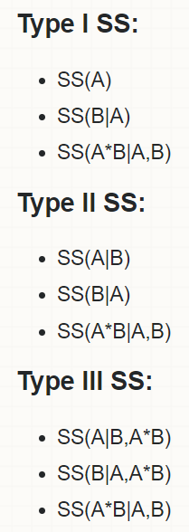

# День 6. ANOVA и продвинутые методы препроцессинга {#anova}

— Дисперсионный анализ (ANOVA)
— Однофакторный и многофакторный ANOVA
— Анализ повторных измерений. Непараметрические аналоги ANOVA
— Пропущенные значения и нормализация
— Зачем нужны кластерный анализ, MDS и PCA в работе с биологическими данными

На финальном занятии мы разберем дисперсионный анализ (ANalysis Of VAriance, ANOVA). Пожалуй, это самый распространенный статистический метод в экспериментальной психологии и многих других дисциплинах. Он очень хорошо подходит под использование для экспериментальных дизайнов, т.е. для исследовательских планов, в которых мы напрямую управляем уровнями независимой переменной. Связь ANOVA и экспериментирования настолько тесная, что некоторые термины пересекатся, но всегда нужно быть осторожными. Как и в случае с линейной регрессией, если мы переменную называем "предиктором", это не дает ей никакой дополнительной каузальной силы. Так же и с ANOVA: мы можем называть какие-то переменные "независимыми", а какие-то "зависимыми", но это не означает автоматически каузальной связи. Просто терминология экспериментирования и ANOVA слишком тесно переплетены исторически.

У дисперсионного анализа есть много разновидностей, которые мы сегодня и будем разбирать, начиная с обычного межгруппового дисперсионного анализа (One-Way ANOVA), заканчивая сложными вариантами этого метода, такими как ANCOVA, факторная ANOVA и ANOVA с повторными измерениями. 

> Здесь будут часто употребляться как термин ANOVA, так и дисперсионный анализ. Это одно и то же. В русскоязычных статьях обычно пишут "дисперсионный анализ", но в быту все говорят "анова". Так проще.

Зачем нам вообще нужен ANOVA? Ранее мы разбирали как сравнивать средние для двух групп с помощью т-теста. Но что если у нас больше двух групп? В принципе, можно использовать много попарных т-тестов и использовать поправки на множественные сравнения (и мы это сегодня будем делать, но попозже). Но обычно делается сравнение сразу всех групп с помощью дисперсионного анализа. Не дайте названию ввести Вас в заблуждение! Дисперсионный анализ - это все то же сравнение средних, только сразу для нескольких групп.

Давайте в этот раз сразу начнем с проведением теста. Мы будем использовать [данные с курса по статистике Университета Шеффилда про эффективность диет](https://www.sheffield.ac.uk/mash/data).

```{r}
library("data.table")
diet <- fread("stcp-Rdataset-Diet.csv")
```


> Да, в этот раз не так весело, просто диеты и их влияние на вес. Увы, даже информации про диеты нет: просто сухие цифры 1, 2 и 3... Зато этот датасет достаточно удобен, понятен и достаточно репрезентативен относительно того, какие данные могут получиться в результате эксперимента.

Итак, начнем с того, что немного причешем наш датасет. 

В данном датасете есть несколько пропущенных значений:

```{r}
sum(!complete.cases(diet))
```

Давайте просто удалим их:  

```{r}
diet <- na.omit(diet)
```

Мы посчитаем переменную weight.loss - разница до и после. А также сделаем факторной переменную Dietf из численной Diet, иначе 1, 2 и 3 будут читаться как численная переменная. То же самое сделаем для переменной, в которой записан id испытуемого.

> Осторожнее, с этим очень легко накосячить: если не перевести нужные численные переменные в факторы, то потом можно получить неверные результаты. А это гораздо хуже, чем просто получить ошибку!  

```{r}
diet[, weight.loss := weight6weeks - pre.weight]
diet[, Dietf := factor(Diet, labels = LETTERS[1:3])]
diet[, Person := factor(Person)]
```

> Хотите понять, что за магия с `LETTERS[1:3]`? Все просто, это зашитая в R константа, примерно как число pi, только содержит все буквы латинского алфавита в виде character вектора. LETTERS выводит ЗАГЛАВНЫЕ буквы, а letters - строчные. Иногда это очень удобно.

##Введение в ANOVA

Давайте сразу возьмем быка за рога и попробуем провести тест:

```{r}
summary(aov(weight.loss ~ Dietf, diet))
```

Хотя результат выглядит незнакомым, но этот синтаксис где-то мы это уже видели... Да ведь здесь все точно как в линейной регрессии! 

И действительно, если откроете хэлп по функции `aov()`, то увидите, что эта функция просто использует функцию `lm()`. Более того, можете даже попробовать вот так:  

```{r}
summary(lm(weight.loss ~ Dietf, diet))
```

Теперь мы получили привычный нам (по предыдущим занятиям) результат, даже значения p-value совпадают. Правда, больше почти ничего общего. Если присмотритесь, то обнаружите, что еще совпадает $F$-value/statistic и степени свободы. Что это за $F$ и как его получают, мы и будем сегодня разбираться.

##Тестирование значимости нулевой гипотезы в ANOVA.

И снова мы повторим логику тестирования значимости нулевой гипотезы. Да-да, опять. Здесь все примерно так же, как и с предыдущими тестами.

1. Формулирование нулевой и альтернативной гипотезы. Наша нулевая гипотеза говорит о том, что между группами нет различий:

$$H_0:\mu_1 = \mu_2 = ... = \mu_n$$

Напоминаю, что греческие буквы означают, что речь идет не о статистиках выборки, а о параметрах генеральной совокупности: нам интересно знать, действительно ли диеты по разному влияют на людей вообще, а не на данной конкретной выборке. Иначе нам достаточно было бы просто посчитать средние и идти пить чай.  

А вот какая будет альтернативная гипотеза? Хочется сказать, что "все средние различаются друг от друга", но это не так. На самом деле, альтернативная гипотеза звучит так, что есть хотя бы одна пара групп, где средние не равны. 

$$H_1: \text{Не все средние равны}$$

2. Подсчет статистики. Мы уже использовали разные статистики ($z$, $t$ и т.п.) для тестирования гипотез. Теперь к ним добавится новая - $F$. Вот ее мы и посчитаем с помощью таблицы ANOVA. 

-------------------------------------------------------------------------------------------------------------------------------------------------------------------
Таблица ANOVA                 Степени свободы    Суммы квадратов            Средние квадраты                                    F-статистика           
---------------------------- ----------------- --------------------------- ----------------------------------------- ----------------------------------
Межгрупповые                  $df_{b}$           $SS_{b}$                  $MS_{b} =\frac{SS_{b}}{df_{b}}$              $F=\frac{MS_{b}}{MS_{w}}$

Внутригрупповые               $df_{w}$           $SS_{w}$                  $MS_{w} =\frac{SS_{w}}{df_{w}}$  

Общие                         $df_{t}$          $SS_{t}= SS_{b} + SS_{w}$             
-------------------------------------------------------------------------------------------------------------------------------------------------------------------


Именно эту таблицу мы видели в аутпуте функции `aov()`:

```{r}
summary(aov(weight.loss ~ Dietf, diet))
```

 
> Здесь вместо between groups (между группами)  - Dietf, а вместо within groups (внутри групп) - Residuals. И действительно, внутригрупповые суммы квадратов - это "остатки" (residuals), которые мы не смогли объяснить разницами между диетами.

Теперь пришло время разобраться с каждой клеточкой этой таблицы, а заодно и погрузиться в суть дисперсионного анализа. Давайте осторожно и без лишних криков взглянем на формулы:  


----------------------------------------------------------------------------------------------------------------------------------------------------------------------------------------------------------------------------------------------------------------------------------------------------------------------
Таблица ANOVA           Степени свободы                                         Суммы квадратов                                                Средние квадраты                                    F-статистика           
--------------------- ---------------------- ---------------------------------------------------------------------------------------- ----------------------------------------------- -----------------------------------------------------------------------------------------
Между                 $df_{b}=J-1$            $SS_{b}= \sum\limits_{j=1}^J \sum\limits_{i=1}^{n_j} (\overline{x_j}-\overline{x})^2$        $MS_{b} =\frac{SS_{b}}{df_{b}}$                     $F=\frac{MS_{b}}{MS_{w}}$

Внутри                $df_{w}=N-J$            $SS_{w}= \sum\limits_{j=1}^J \sum\limits_{i=1}^{n_j} (x_{ij}-\overline{x_j})^2$              $MS_{w} =\frac{SS_{w}}{df_{w}}$  

Общие                 $df_{t}=N-1$            $SS_{t}= \sum\limits_{j=1}^J \sum\limits_{i=1}^{n_j} (x_{ij}-\overline{x})^2$             
----------------------------------------------------------------------------------------------------------------------------------------------------------------------------------------------------------------------------------------------------------------------------------------------------------------------

$J$ означает количество групп, $N$ - общее количество наблюдений во всех группах, $n_j$ означает количество наблюдений в группе j, а $x_{ij}$ - наблюдение под номером $i$ в группе $j$. 

Да, тут много формул, верно. Но суть довольно проста. Есть вариабельность зависимой переменной: как потеря веса распределена между испытуемыми. Она складывается из вариабельности внутри групп и между группами: $SS_t = SS_b +SS_w$. Вариабельность обозначается $SS$ и означает "сумму квадратов" (sum of squares) - это то же, что и дисперсия, только мы не делим вме в конце на количество наблюдений (или количество наблюдений минус один): $$SS = \sum\limits_{i=1}^{n_j} (x_{i}-\overline{x})^2$$ 

Мы здесь считаем три суммы квадратов: общие, внутригрупповые и межгрупповые. При этом $SS_t = SS_b +SS_w$, то есть общие суммы квадратов "раскладываются" на межгрупповые и внутригрупповые (см. рисунок \ref{fig:fig1}). 

```{r, echo = FALSE, fig.cap="\\label{fig:fig1}Суммы квадратов в ANOVA"}
library(DiagrammeR)
library(DiagrammeRsvg)
library(rsvg)
my_graph <- "
  digraph nicegraph {
      
      graph [layout = dot, rankdir = BU]
      
      node [shape = box]
      a [label = 'SS@_{t}   (Общие суммы квадратов)']
      b [label = 'SS@_{b}   (Межгрупповые суммы квадратов)']
      c [label = 'SS@_{w}   (Внутригрупповые суммы квадратов)']
      
      a -> {b,c}

      
      }"

pdf_digraph <- function(filename, code){
  capture.output({
  g <- grViz(code)
  DiagrammeRsvg::export_svg(g) %>% charToRaw %>% rsvg::rsvg_pdf(filename)
  },  file='NUL')
  knitr::include_graphics(filename)
}

pdf_digraph('tmp2.pdf', code = my_graph)
```


Если попробуем это представить зрительно, то эти три суммы квадратов будут выглядеть примерно как на рисунке \ref{fig:fig2}

```{r, echo = FALSE, fig.cap='\\label{fig:fig2}Общая вариабельность, межгрупповая вариабельность и внутригрупповая вариабельность в ANOVA. На картинке это сложно отразить, поэтому поясняю словами, что, собственно, "квадраты" означают не сами расстояния, нарисованные палочками, а их квадраты. Можете мысленно представить, что каждая такая вертикальная палочка - это сторона квадрата. Площади этих квадратов мы суммируем.'}
diet2 <- merge(diet, diet[, .(meanw = mean(weight.loss)), by = Diet], by = "Diet")
diet2[,ymax:= pmax(weight.loss,meanw)]
diet2[,ymin:= pmin(weight.loss,meanw)]
diet2[,ymaxtotal:=pmax(weight.loss, mean(weight.loss))]
diet2[,ymintotal:=pmin(weight.loss, mean(weight.loss))]
diet2[,ymaxbetween:=pmax(mean(weight.loss), meanw)]
diet2[,yminbetween:=pmin(mean(weight.loss), meanw)]
diet2[,lossbydiet := mean(weight.loss), by = Dietf]

library(cowplot)

g <- ggplot(diet2)+
  geom_point(aes(x = s, y = weight.loss))+
  geom_hline(aes(yintercept = mean(weight.loss)))+
  scale_x_discrete(labels = LETTERS[1:3])+
  labs(x = "", y = "Потеря веса")+
  theme(plot.title = element_text(hjust = 0, size = 8),
        axis.title = element_text(size=8),
        axis.text = element_text(size=8))

s <- c(seq(0.55,1.45, length.out = diet2[Diet == 1, .N]), 
       seq(1.55, 2.45, length.out = diet2[Diet == 2, .N]), 
       seq(2.55, 3.45, length.out = diet2[Diet == 3, .N]))
g1 <- g+geom_errorbar(aes(x = s, ymin = ymin, ymax = ymax), width = 0, colour = "orange", size = 0.3)+
  geom_errorbar(aes(x = Diet, ymax = weight.loss, ymin = weight.loss),
                data = diet[,.(weight.loss = mean(weight.loss)), by = Diet], width = 1)+
  labs(title = "Внутригрупповая вариабельность")
  
  
g2 <- g+geom_errorbar(aes(x = s, ymin = ymintotal, ymax = ymaxtotal), colour = "purple", width = 0, size = 0.3)+
  labs(title = "Общая вариабельность")

g3 <- g+geom_errorbar(aes(x = s, 
                          ymin = pmin(lossbydiet, mean(weight.loss)), 
                          ymax = pmax(lossbydiet, mean(weight.loss))), 
                      colour = "red", width = .05, size = 0.3)+
  labs(title = "Межгрупповая вариабельность")

plot_grid(g2,g3,g1, ncol = 3)
detach("package:cowplot", unload=TRUE)
```


```{r}
sumofsquares <- function(x) sum((x - mean(x))^2)
```

```{r}
totalss <- sumofsquares(diet$weight.loss)

diet[,lossbydiet := mean(weight.loss), by = Dietf]
withinss <- diet[, sum((weight.loss - lossbydiet)^2)]
betweenss <- diet[, sum((lossbydiet - mean(weight.loss))^2)]
```

Обновим нашу табличку, поставив полученные суммы квадратов вмета формул:


-----------------------------------------------------------------------------------------------------------------------------------------------------------------------------------------------
 Таблица ANOVA           Степени свободы        Суммы квадратов                                         Средние квадраты                                                   F-статистика           
--------------------- ---------------------- ---------------------------------------------------- ---------------------------------------------------------- ----------------------------------
Между                  $df_{b}=J-1$            $SS_{b}=$ `r round(betweenss, 2)`                                        $MS_{b} =\frac{SS_{b}}{df_{b}}$                                                   $F=\frac{MS_{b}}{MS_{w}}$

Внутри                 $df_{w}=N-J$            $SS_{w}=$ `r round(withinss, 2)`                                         $MS_{w} =\frac{SS_{w}}{df_{w}}$  

Общие                  $df_{t}=N-1$            $SS_{t}=$ `r round(totalss, 2)`           
-----------------------------------------------------------------------------------------------------------------------------------------------------------------------------------------------

  

Кстати, что будет, если поделить межгрупповую сумму квадратов на общую сумму квадратов? 

```{r}
betweenss/totalss
```

Получится $R^2$. Помните, мы использовали $R^2$(коэффициент детерминации) в линейной регрессии для оценки модели? Логично: это соотношение объясненной дисперсии к общей, не может быть меньше нуля и больше единицы. 


Перед суммами квадратов стоят степени свободы. В отличие от т-теста, когда у нас был один показатель степени свободы, у нас здесь два показателя. Один из них связан с размером групп, другой - с размером выборки:

```{r}
totaldf <- diet[,.N] - 1
betweendf <- diet[,nlevels(Dietf)] - 1
withindf <- diet[,.N] - diet[,nlevels(Dietf)]
```

> Хитрая функция nlevels() просто позволяет посчитать количество уровней фактора.

Добавим в табличку степени свободы:

-------------------------------------------------------------------------------------------------------------------------------------------------------------------
 Таблица ANOVA           Степени свободы                   Суммы квадратов                                               Средние квадраты                                                                 F-статистика           
--------------------- -------------------------------- ------------------------------------------------- ------------------------------------------------------- -------------------------------------------------------
Между                 $df_{b}=$ `r betweendf`                          $SS_{b}=$ `r round(betweenss, 2)`                               $MS_{b} =\frac{SS_{b}}{df_{b}}$                                              $F=\frac{MS_{b}}{MS_{w}}$

Внутри                $df_{w}=$ `r withindf`                           $SS_{w}=$ `r round(withinss, 2)`                                $MS_{w} =\frac{SS_{w}}{df_{w}}$  

Общие                 $df_{t}=$ `r totaldf`                            $SS_{t}=$  `r round(totalss, 2)`           
-------------------------------------------------------------------------------------------------------------------------------------------------------------------

  

Теперь нужно посчитать средние квадраты (mean squares): нужно разделить суммы квадратов на соответствующие степени свободы.  

```{r}
withinms <- withinss/withindf
betweenms <- betweenss/betweendf
```

Почти готово. Используемая нами в ANOVA статистика F - это отношение межгрупповых средних квадратов к внутригрупповым средним квадратам:

```{r}
f <- betweenms/withinms
f
```

Все, готово:  


-------------------------------------------------------------------------------------------------------------------------------------------------------------------
 Таблица ANOVA           Степени свободы                      Суммы квадратов                               Средние квадраты                                                                 F-статистика           
--------------------- -------------------------------------- --------------------------------------------- ------------------------------------------------ ----------------------------------------------
Между                 $df_{b}=$ `r betweendf`                              $SS_{b}=$ `r round(betweenss, 2)`                              $MS_{b} =$ `r round(betweenms,2)`                                   $F=$ `r round(f,2)`

Внутри                $df_{w}=$ `r withindf`                               $SS_{w}=$ `r round(withinss, 2)`                           $MS_{w} =$ `r round(withinms,2)`  

Общие                 $df_{t}=$ `r totaldf`                                $SS_{t}=$  `r round(totalss, 2)`           
-------------------------------------------------------------------------------------------------------------------------------------------------------------------

3. Подсчет p-value. Помните, как это происходило в т-тесте? Мы смотрели, как статистика распределена при верности нулевой гипотезы (то есть при отсутствии различий в генеральной совокупности). Потом мы считали вероятность получения нашей статистики (или более экстремальной) как площадь под кривой от нашего $t$ и до бесконечности. Мы еще умножали эту вероятность на 2, чтобы наш тест был двусторонним, но этого нам делать не нужно в случае ANOVA и $F$-статистики. Почему? Давайте взглянем на распределение $F$. Его форма сильно зависит от двух степеней свобод. Давайте нарисуем это распределение. Для этого нам понадобится функция df (из семейства функций для F-распределения: df(), pf(), qf(), rf()). См. рисунок \ref{fig:fig3}. 

```{r, fig.cap="\\label{fig:fig3}F-распределение при верности нулевой гипотезы (см. детали в тексте)", out.width = '60%'}
v <- seq(0.1,10, 0.01)
fdist <- data.frame(fvalues = v, pdf = df(v, betweendf, withindf))

library(ggplot2)

label <- paste0("F(", betweendf, ", ", withindf, ") = ", round(f, 3))

ggplot(fdist, aes(x = fvalues, y = pdf))+
  geom_line()+
  geom_vline(xintercept = f)+
  annotate("text", x = f+1, y = 0.2, label = label)+
  scale_y_continuous(expand=c(0,0)) + 
  theme_minimal()+
theme(axis.line.y = element_blank(),
      axis.ticks.y = element_blank(),
      axis.text.y = element_blank(),
      axis.title.y = element_blank())  
```

Оно вообще ни разу не симметричное! Поэтому нам нужно считать только площадь от нашего $F$ до плюс бесконечности. Здесь это не очень много. Чем больше $F$, тем больше соотношение межгрупповой вариабельности (интересующие нас различия плюс "шум") к внутригрупповой (необъясненный "шум" измерения).

На самом деле, $F$-распределение отнюдь не всегда выглядит так. С другими степенями свободами (т.е. с другим количеством групп и наблюдений) его форма будет совсем другая (см. рисунок \ref{fig:fig4}) . Но $F$-статистика никогда не может быть меньше нуля. Просто потому, что средние квадраты - это всегда какие-то положительные значения.  

```{r, echo=FALSE, fig.cap="\\label{fig:fig4}F-распределения с разными степенями свободы. Картинка взята из Википедии", out.width = '60%'}
knitr::include_graphics("800px-F-distribution_pdf.svg.png.png")
```

Итак, чтобы подсчитать p-value нам нужно просто воспользоваться функцией pf() подставив в качестве аргументов нашу $F$-статистику и нужные степени свободы (два значения). Это будет площадь под кривой плотности вероятности от нуля до $F$. Поскольку нас интересует площадь от $F$ до плюс бесконечности, то результат pf() нужно вычесть из единицы:

```{r}
1 - pf(f, betweendf, withindf)
```

4. Отлично, последний этап - сравнение p-value с нашим уровнем $\alpha$, который по дефолту 0.05. Ну и действительно, p-value меньше 0.05, поэтому мы можем отвергнуть нулевую гипотезу, что средние всех групп в генеральной совокупности одинаковые. Но можем ли мы сделать вывод, какие именно группы различаются? По одному ANOVA, увы, нет. Для этого нам нужно провести post-hoc тесты. 

##Post-hoc тесты  

Post-hoc с латинского переводится как "после этого". Post-hoc тесты проводятся в случае, если Вы уже отвергли нулевую гипотезу ANOVA, но хотите узнать, какие именно группы различаются между собой. И здесь мы снова встречаемся с проблемой множественных сравнений (как и в случае с корреляцией всего со всем). 

Условно говоря, здесь есть два основных подхода для проведения post-hoc тестов: 

- Применение различных поправок к результатам т-тестов - это мы уже проходили. Поправка Бонферрони, поправка Холма и т.п. Процедура ничем не отличается от того, что мы делали с корреляциями, только теперь у нас т-тесты вместо корреляций. Есть удобная функция `pairwise.t.test()` для этого:  

```{r}
pairwise.t.test(diet$weight.loss, diet$Dietf)
```

Мы видим, что при использовании поправки Холма есть различия между результатами диет А и С, В и С, но различия между А и В нет значимых различий.  

- Другой подход - специальные post-hoc тесты для сравнения нескольких групп. Как и в случае с поправками, есть более  и менее консервативные варианты, есть довольно специфические, например, тест Даннетта (Dunnett's test): он позволяет сравнить несколько средних с одним контролем (например, плацебо). Ну а самый распространенный post-hoc тест - это тест Тьюки (Tukey Honest Significant Differences = Tukey HSD). Для этого в R есть простая функция `TukeyHSD()`, которая применяется к аутпуту функции `aov()` - объекту класса `aov()`:

```{r}
modelanova <- aov(weight.loss ~ Dietf, diet)
TukeyHSD(modelanova)
```

Здесь мы видим результаты сравнения каждой группы с каждой, доверительный интервал и уровень значимости ($p_{adj}$ - скорректированный p-value). Результат здесь получился примерно такой же, как и в случае с использованием поправки Холма: результаты использования диет C и А, С и В статистически значимо различаются (при $\alpha$ равной 0.05), а между А и В не обнаружено статистически значимых различий.

##Другие способы проведения ANOVA в R.  

Встроенная функция `aov()` довольно удобная для проведения простой ANOVA. 

```{r}
modelanova <- aov(weight.loss ~ Dietf, diet)
summary(modelanova)
```

Более того, мы уже обнаружили, что можно применить функцию lm() - это даст такие же результаты. Это может показаться странным, ведь мы раньше использовали в линейной регрессии только численные предикторы. Мы уже пробовали когда-то использовать дихотомические предикторы (когда у нас два уровня, которые могут быть представлены как 0 и 1), чтобы убедиться, что получаем такие же результаты, как и для т-теста. Но что если у нас три группы? Тогда функция lm() автоматически создает новые переменные с помощью так называемого dummy coding. 

###Dummy coding  

Dummy coding - это способ превратить номинальную (качественную) переменную в набор количественных. Для этого мы можем просто создать новые переменные типа "является ли эта диета диетой Х", где Х - тип диеты. Давайте сделаем это.

```{r}
diet[,isA:= as.numeric(Dietf == "A")]
diet[,isB:= as.numeric(Dietf == "B")]
diet[,isC:= as.numeric(Dietf == "C")]

diet[c(1:2,15:16,35:36),c("Dietf", "isA", "isB", "isC")]
```

Заметьте, что один (любой) столбик здесь лишний. Если выбранная диета не является диетой В и не является диетой С, то, очевидно, это диета А (если у нас нет других диет - хорошо, что в жизни это не так). Поэтому для dummy coding мы можем удалить одну из колонок:

```{r}
diet[, isA := NULL]
```

А теперь используем новые колонки в качестве предикторов для линейной регрессии:  

```{r}
summary(lm(weight.loss ~ isB + isC, diet))
```

Для сравнения, сделаем линейную регрессию с категориальным предиктором без dummy coding:  

```{r}
anova_as_lm <- lm(weight.loss ~ Dietf, diet)
summary(anova_as_lm)
```

Абсолютно то же самое! Более того, есть специальная функция anova(), которая возвращает таблицу ANOVA из объекта lm:

```{r}
anova(anova_as_lm)
```

###ANOVA как частный случай линейной регрессии

Таким образом, ANOVA - это, в некотором смысле, просто частный случай линейной регрессии, когда предиктор представлен в номинальной шкале. В принципе, что ANOVA (со всеми ее разновидностями), что множественная линейная регрессия, что т-тест являются частными случаями **общей линейной модели** (**general linear model**). Не путать с **обобщенной линейной моделью** (**generalized linear model**)! Это еще более широкое обобщение, которое включает в себя как линейную, так и, например, логистическую регрессию.

> Да, с названием "обобщенная линейная модель" авторы несколько облажались, мне кажется.

Если ANOVA - это линейная регрессия, то и требования к данным в ANOVA все те же, что и для линейной регрессии, правда, называются они немного по-другому. С нормальностью ошибок все так же - нужно, чтобы остатки (residuals) были распределены более-менее нормально (см. рисунок \ref{fig:fig5}).

```{r, fig.cap="\\label{fig:fig5}Гистограмма распределения остатков", out.width='80%'}
hist(residuals(modelanova))
```

Впрочем, довольно серьезные отклонения от нормальности для ANOVA не такая уж и проблема (если нет серьезных выбросов, а их мы бы заметили на гистограмме). 

Второе важное допущение - это гомогенность дисперсий, т.е. равенство дисперсий, т.е. то, что в случае линейной регрессии называют гомоскедастичностью. Если Вы подумали, что это слово придумали только чтобы запутать, то... возможно, Вы и правы. Гомогенность дисперий просто означает, что распределение ошибок не различается в зависимости от группы.

```{r, fig.cap="\\label{fig:fig6}Вариабельность остатков в зависимости от группы", out.width="80%"}
diet$residuals <- residuals(modelanova)

ggplot(diet, aes(x = Dietf, y = residuals))+
  geom_point()
```

Все вполне пристойно: нет какой-то одной группы, у которой разброс ошибок сильно больше (или меньше), чем у других (см. рисунок \ref{fig:fig6}). Впрочем, есть и более формальный способ оценить равенство дисперсий: с помощью теста Ливиня (Levene's test). Для того, чтобы его провести мы воспользуемся новым пакетом `ez` (читается как "easy"). Он значительно упрощает проведение ANOVA, особенно при более сложных дизайнах, чем тот, который мы использовали, а заодно и проводит нужные дополнительные тесты.

```{r}
library("ez") #сначала install.packages("ez") если у Вас нет этого пакета
ezANOVA(data = diet,
        dv = weight.loss,
        wid = Person,
        between = Dietf,
        detailed = T)
```

> Другой способ провести тест Ливиня - функция leveneTest из пакета car:

```{r}
car::leveneTest(diet$weight.loss, diet$Dietf)
```


Пользоваться функцией `ezANOVA()` очень просто: нужно прописать данные в `data`, название зависимой переменной в `dv`, прописать переменную с `id` в `wid` (например, переменная с номером испытуемого, если такой нет, то нужно ее создать), а в `between` - групповую переменную. Почему between? Потому что это "обычный" ANOVA (он же One-way ANOVA) предполагает, что все измерения независимы друг от друга, т.е. что-то вроде расширения независимого т-теста. 

В результате мы получаем суммы квадратов, степени свободы, значение $F$ и p-value. Кроме того, в аутпуте еще и любезно проставлена звездочка, если p-value меньше 0.05. На случай, если кто-то, продравшись через восемь семинаров по R и статистике, не может самостоятельно сравнить два числа друг с другом, да. Ладно, эти звездочки довольно удобны, что я тут придираюсь. 

Справа в первой строчке стоит что-то новое - это Generalized eta squared, размер эффекта для факторов ANOVA. Вообще, оценок размера эффекта для ANOVA много разных, и в них легко запутаться. Какой из них лучше - сложный вопрос, который выходит за рамки этого курса. Какого-то устоявшегося решения нет, к сожалению. Поэтому важно не просто отмечать размер эффекта, а какой именно из них используется. Что у них общего, так это то, что все они могут принимать значение от 0 до 1, причем чем больше значение размера эффекта, тем больше объясненная фактором дисперсия по отношению к необъясненной. Самые сложности начинаются, когда у нас много факторов в дисперсионном анализе. В однофакторной ANOVA разногласий поменьше (хотя они все равно есть), более того, в данном конкретном случае Generalized eta squared равен межгрупповой сумме квадратов, поделенной на общую сумму квадратов, то есть равен $R^2$, который мы уже считали раньше: 

```{r}
betweenss/totalss
```

Это формула для обычной (нескорректированной) eta squared:

$$\eta^2 = \frac{SS_b}{SS_t}$$

###Обратно в aov!

Последний важный момент в функции `ezANOVA()`, это возможность создать объект `aov` с помощью параметра `return_aov = T`, как будто бы мы пользовались функцией `aov()`. Это может пригодиться, например, для тех же post-hoc тестов:  

```{r}
anova_by_ez <- ezANOVA(data = diet,
        dv = weight.loss,
        wid = Person,
        between = Dietf,
        detailed = T,
        return_aov = T)
summary(anova_by_ez$aov)
```

Вуаля!  

##Factorial ANOVA (Многофакторный ANOVA)  

Раньше мы говорили об One-Way ANOVA, что означает "однофакторную" ANOVA. Тем не менее, в отличие от т-тестов, мы можем исследовать влияние сразу нескольких категориальных переменных на зависимую переменную. В принципе, кардинальных различий нет, просто теперь у нас тестируются сразу несколько факторов. В статьях обычно обозначается количество факторов и уровней в них примерно так: "3x2x2 ANOVA". В данном конкретном случае это означает, что была проведена трехфакторная ANOVA, причем в первом факторе было три уровня, а во втором и третьем - по два. Мы же сделаем 3x2 ANOVA с факторами "Диета" и "Пол", с тремя диетами и двумя полами. Здесь у нас есть две гипотезы: что диета влияет на потерю веса и что пол, в целом, влияет на потерю веса. Последнее довольно странно, да. Но в факториальном дисперсионном анализе появляются гипотезы взаимодействия - "пересечения" факторов. В данном случае, это будет интерпретироваться как "разные диеты эффективны по-разному для разных полов". Давайте нарисуем это для наглядности (см. рисунок \ref{fig:fig7}). 

> Отображать на графике влияние больше чем одной переменной не так просто. Самый простой способ (особенно для ситуации двух категориальных независимых переменных с не очень большим количеством уровней) - нарисовать несколько линий. Небольший хинт: тот фактор, у которого больше уровней, лучше расположить по оси Х, а тот, у которого меньше уровней, как независимые линии.  

```{r, fig.cap="\\label{fig:fig7}Пример взаимодействия двух переменных.", out.width = '80%'}
diet[, genderf:=factor(gender, labels = c("ж", "м"))]
sem <- function(x) sd(x)/sqrt(length(x))
pivot <- diet[,.(meanloss = mean(weight.loss), se = sem(weight.loss)), by = .(Dietf, genderf)]

library(ggplot2)

pd = position_dodge(0.05)
ggplot(pivot, aes(x = Dietf, y = meanloss, colour = genderf))+
  geom_line(aes(group = genderf), position = pd)+
  geom_pointrange(aes(ymin = meanloss - se, ymax = meanloss +se), position = pd)

```

Хотя в среднем диета С эффективнее остальных, она особенно эффективна для женщин. По крайней мере, так говорит картинка. Но хотелось бы узнать, насколько резонно переносить такие выводы на генеральную совокупность.  

Итак, у нас будет три гипотезы: о влиянии диеты, пола и их взаимодействия. Как это сделать в R? Давайте сделаем это с помощью функции aov() для начала:  

```{r}
summary(aov(weight.loss ~ Dietf + genderf + Dietf:genderf, diet))
```

Пересечение факторов мы обозначили знаком `:`. Но можно и проще:  

```{r}
summary(aov(weight.loss ~ Dietf * genderf, diet))
```

Вместо `+` мы использовали `*`, что авторматически создает нужные взаимодействия.  

Теперь же сделаем с помощью `ezANOVA()`. Чтобы задать несколько колонок, нам нужно использовать `.()`:  

```{r}
ezANOVA(data = diet,
        dv = weight.loss,
        wid = Person,
        between = .(Dietf, genderf))
```

Итак, взаимодействие оказалось статистически значимым, что поддерживает нашу гипотезу о том, что диеты по-разному эффективны для разных полов.  

###SS Type I, II, III

Результаты немного отличаются, Вы заметили? Дело в том, что в ситуации несбалансированного ANOVA, т.е. когда в разных подгруппах разное количество наблюдений, возникает некоторая неопределенность на тему того, как считать сумму квадратов. У нас как раз несбалансированный дизайн (немного, но лучше избегать этого):  

```{r}
diet[,.N, by = .(Dietf, genderf)]
```

Всего есть три типа, они так и называются SS (сумма квадратов) Type I, Type II, Type III. Разница, как видите, не очень большая, но если Вам стало интересно, то советую почитать [здесь](https://stats.stackexchange.com/questions/20452/how-to-interpret-type-i-type-ii-and-type-iii-anova-and-manova) или [здесь](https://mcfromnz.wordpress.com/2011/03/02/anova-type-iiiiii-ss-explained/). Если коротко, то разница в том, считать ли сумму квадратов для фактора после "вычета" предыдущих эффектов (последовательно, SS Type I), после вычета всех остальных факторов (иерархически, SS Type II) или же после вычета всех остальных факторов и взаимодействий (SS Type III). 

```{r, echo=FALSE, fig.cap="\\label{fig:fig8}SS Types I, II и III", out.width = '80%'}

```

Функция `aov()` использует Type I SS (можете это проверить, поменяв порядок предикторов, - результат будет разный!), а в `ezANOVA()` используется по дефолту SS Type II, но это можно поменять с помощью параметра `type = ` поставив 1, 2 или 3, соответственно. Если попробуете поставить `type = 1`, то увидите предупреждение, что этого делать не стоит, и авторы пакета надеются, что это делается исключительно в демонстрационных целях. Действительно, SS Type I рекомендуется избегать, а вот дискуссия между SS Type II и III - тот еще холивар. Ну, ладно, это холивар только для гиков, да и те понимают, что это слишком уж гикство для холиваров. 

Ок, так что же выбрать? В принципе, SS Type II рекомендуют больше. Или, на крайняк, SS Type III. Что бы Вы не выбрали (II или III), на Вашей стороне будет банда статистиков, которые будут топить за Вашу позицию.

> SPSS и SAS по умолчанию используют SS Type III.

##ANCOVA (ANalysis of COVAriance; Ковариационный анализ)  

По названию выглядит как какой-то еще дофига сложный метод, да? Нет, все примерно как и раньше, только теперь появляется *ковариата*. Это дополнительная числовая переменная, которая (в идеале) объясняет значительную часть дисперсии зависимой переменной. Таким образом, если "вычесть" влияние этой переменной, то можно уменьшить внутригрупповую изменчивость, т.е. получить более выраженный эффект и повысить статистическую мощность.  

Давайте проведем ANCOVA с ковариатой "Height" (рост):

```{r}
ezANOVA(data = diet,
        dv = weight.loss,
        wid = Person,
        between = Dietf,
        between_covariates = Height,
        detailed = T)
```

В принципе, ANCOVA - это та же линейная регрессия (общая линейная модель), только в ней присутствуют как численные, так и номинальные переменные.  

##Repeated measures ANOVA (Дисперсионный анализ с повторными измерениями)

Как и в случае с т-тестом, если мы хотим сравнить связанные выборки, то мы должны пользоваться несколько другими формулами. Очень часто "зависимые выборки" - это ситуация с внутригрупповым (within-group) дизайном эксперимента: каждый испытуемый получает все уровни независимой переменной на свою голову или любые другие части своего многострадального тела, а результат этого воздействия записывают. Другой частый вариант - это "до" и "после". Ранее мы сравнивали изменения (gain score) до и после той или иной диеты. Тем не менее, обычно встречается использование значений до и после как отдельного фактора в так называемом within-subjects ANOVA или repeated measures ANOVA (RM-ANOVA; дисперсионный анализ с повторными измерениями). Если обычный дисперсионный анализ можно рассматривать как "расширение" независимого т-теста, то дисперсионный анализ с повторными измерениями - это своеобразное расширение зависимого т-теста. Только мы опять используем F-статистику
Давайте проверим, является ли диета С эффективной, сравнив значения до или после. Для этого нам понадобится `melt()` для превращения широкого датафрейма в длинный:  

```{r}
dietlong <- melt(diet, 
                 measure = c("pre.weight", "weight6weeks"), 
                 variable = "time", 
                 value = "weight")
```

Возьмем только диету С:  

```{r}
dietlongC <- droplevels(dietlong[Dietf == "C",])
```

> Функция droplevels() позволяет избавиться от лишних уровней переменных. Дело в том, что в нашем сабсете уже нет многих испытуемых, а вот запись в факторе Person о них сохранилось. Это может привести к ошибке в некоторых случаях.

Теперь проведем RM-ANOVA:

```{r}
ezANOVA(dietlongC,
        dv = weight,
        wid = Person,
        within = time)
```

Пользуясь функцией `aov()`, нужно прописать переменную, которая группирует ответы одного испытуемого, с помощью `Error()`:  

```{r}
summary(aov(weight ~ time +Error(as.factor(Person)), dietlongC))
```

Принципиальное отличие от обычного ANOVA заключается в том, что внутригрупповые суммы квадратов могут быть разделены на две части: "ошибку" (сумму квадратов остатков) и межиндивидуальные различия. Последние мы можем вычесть, что даст нам большую мощность, чем если бы мы просто сравнивали результаты после (см. рисунок \ref{fig:fig9}).  

```{r, echo = FALSE , fig.cap="\\label{fig:fig9}Суммы квадратов в дисперсионном анализе с повторными измерениями", out.width = '80%'}
library(DiagrammeR)
library(DiagrammeRsvg)
library(rsvg)
my_graph <- "
  digraph nicegraph {
      
      graph [layout = dot, rankdir = BU]
      
      node [shape = box]
      a [label = 'SS@_{t}   (Общие суммы квадратов)']
      b [label = 'SS@_{b}   (Межгрупповые суммы квадратов)']
      c [label = 'SS@_{w}   (Внутригрупповые суммы квадратов)']
      d [label = 'SS@_{s}   (Межиндивидуальные суммы квадратов)']
      e [label = 'SS@_{e}   (Суммы квадратов остатков)']
      
      a -> {b,c}
      c -> {d,e}
      
      }"

pdf_digraph <- function(filename, code){
  capture.output({
  g <- grViz(code)
  DiagrammeRsvg::export_svg(g) %>% charToRaw %>% rsvg::rsvg_pdf(filename)
  },  file='NUL')
  knitr::include_graphics(filename)
}

pdf_digraph('tmp.pdf', code = my_graph)
```


###Пример расчета RM-ANOVA вручную  

Чтобы было понятнее, что происходит внутри, давайте посчитаем эту самую RM-ANOVA самостоятельно. Для начала возьмем для удобства сабсет из нашего исходного датасета в широком формате:
```{r}
dd <- diet[Dietf == "C",c("pre.weight", "weight6weeks")]
head(dd)
```

Формулы здесь немного сложнее, за счет того, что внутригрупповые суммы квадратов мы разделяем на индиудуальные и на остатки.


----------------------------------------------------------------------------------------------------------------------------------------------------------------------------------------------------------------------------------------------------------------------------------------------------------------------
Таблица ANOVA           Степени свободы                                         Суммы квадратов                                                Средние квадраты                                    F-статистика           
----------------- ---------------------- ---------------------------------------------------------------------------------------- ----------------------------------------------- ----------------------------------
Между                 $df_{b}=J-1$           $SS_{b}= n \sum\limits_{j=1}^J (\overline{x_j}-\overline{x})^2$                            $MS_{b} =\frac{SS_{b}}{df_{b}}$                $F=\frac{MS_{b}}{MS_{e}}$

Внутри                $df_{w}=N-J$           $SS_{w}= SS_t - SS_b$              

Индиви-дуальные       $df_s = n-1$           $SS_s= J \sum\limits_{i=1}^{n} (\overline{x_i} -\overline{x})^2$ 

Остатки               $df_e=N-J-n+1$         $SS_e= SS_w - SS_s$                                                                         $MS_{e} =\frac{SS_{e}}{df_{e}}$  

Общие                 $df_{t}=N-1$           $SS_{t}= J \sum\limits_{i=1}^{n_j} (x_{ij}-\overline{x})^2$             
----------------------------------------------------------------------------------------------------------------------------------------------------------------------------------------------------------------------------------------------------------------------------------------------------------------------


Посчитаем суммы квадратов:  

```{r}
globalmean <-  mean(unlist(dd))
totalss <- sum((unlist(dd) - globalmean)^2)
```

Просто сумма квадратов по отношению к среднему всех значений

```{r}
betweenss <- sum((apply(dd,2,mean) - globalmean)^2) * nrow(dd)
```

Выглядит сложно, но это просто суммы квадратов средних по столбцам по отношению к среднему всех значений.

```{r}
withinss <- totalss - betweenss
```

Внутригрупповая сумма квадратов - это общая сумма квадратов минус межгрупповая. А теперь нам нужно разделить внутригрупповуюю сумму квадратов на части:

```{r}
subjss <- sum((apply(dd,1,mean) - globalmean)^2)*ncol(dd)
```

Вот это и есть наши межиндивидуальные различия. Заметьте, они составляют большую часть разброса данных. Это вполне логично: даже если диета весьма эффективная, разброс по весу у людей обычно гораздо больше предполагаемого эффекта и его разброса в выборке.  

```{r}
errorss <- withinss - subjss
```

Теперь посчитаем степени свободы:  

```{r}
totaldf <- length(unlist(dd)) - 1
betweendf <- ncol(dd) - 1
subjdf <- nrow(dd) -1
withindf <- totaldf - betweendf
errordf <- withindf - subjdf
```

Осталось посчитать средние межгрупповые квадраты и средние квадраты ошибки...  

```{r}
betweenms <- betweenss/betweendf
errorms <- errorss/errordf
```

... и поделить одно на другое, чтобы получить F:  

```{r}
f <- betweenms/errorms
```

Итоговая таблица:  

----------------------------------------------------------------------------------------------------------------------------------------------------------------------------------------------------------------------------------------------------------------------------------------------------------------------
Таблица ANOVA           Степени свободы                                         Суммы квадратов                                                Средние квадраты                                    F-статистика           
----------------- ---------------------- ---------------------------------------------------------------------------------------- ----------------------------------------------- ----------------------------------
Между                 $df_{b}=$  `r betweendf`         $SS_{b}=$ `r round(betweenss,2)`                                                                          $MS_{b} =$  `r round(betweenms,2)`                              $F=$ `r round(f,2)`

Внутри                $df_{w}=$ `r withindf`           $SS_{w}=$ `r round(withinss,2)`              

Индиви-дуальные       $df_s=$ `r subjdf`               $SS_s=$ `r round(subjss,2)`

Остатки               $df_e=$ `r errordf`              $SS_e=$ `r round(errorss,2)`                                                                              $MS_{e} =$ `r round(errorms,2)`  

Общие                 $df_{t}=$ `r totaldf`            $SS_{t}=$ `r round(totalss,2)`             
----------------------------------------------------------------------------------------------------------------------------------------------------------------------------------------------------------------------------------------------------------------------------------------------------------------------


$F$ получился большой! Давайте теперь посмотрим, насколько получить такой или больше F при условии верности нулевой гипотезы:  

```{r}
1 - pf(f, betweendf, errordf)
```

В данном конкретном случае мы могли применить просто зависимый т-тест, ведь у нас всего две выборки (до и после):  

```{r}
t.test(dd$pre.weight,dd$weight6weeks, paired = T, var.equal = T)
```

Заметьте, то же самое p-value. Более того, в случае двух выборок $F$ - это просто квадрат от $t$:  

```{r}
t <- t.test(dd$pre.weight,dd$weight6weeks, paired = T, var.equal = T)$statistic
t
t^2
```

##Смешанный внутригрупповой-межгрупповой дисперсионный анализ (Mixed between-within-subjects ANOVA)  

Нам никто не запрещает совмещать оба типа ANOVA в одном тесте. В ezANOVA() это делается просто с помощью прописывания разных факторов в нужных переменных: between и within.  

```{r}
ezANOVA(data = dietlong,
        wid = Person,
        dv = weight,
        between = Dietf,
        within = time)
```

Здесь нас интересует взаимодействие диеты и времени. Мы получили тот же самый результат, что и при обычном ANOVA на разницу между до и после. Что неудивительно!  

> А вот если мы проведем ANCOVA на вес после с ковариатой "вес до", то результат будет несколько другим. Разница в том, что в таком случае мы не просто "вычитаем" значение веса до диеты, но используем его как предиктор - с оценкой его коэффициента:  

```{r}
ezANOVA(data = diet,
        wid = Person,
        dv = weight6weeks,
        between_covariate = pre.weight,
        between = Dietf)
```

##Непараметрические аналоги ANOVA  

Как было описано выше, ANOVA довольно устойчив к разным отклонениям от нормальности и некоторой гетероскедастичности (разным дисперсиям в выборках). Но если уж у Вас данные ну совсем-совсем ненормальные, несимметричные, а от преобразований шкалы Вы по каким-то причинам отказались, то стоит упомянуть о непараметрических аналогах ANOVA. 

###Тест Краскела-Уоллеса  

Это тест Краскела-Уоллеса - обобщение теста Манна-Уитни на несколько выборок (т.е. аналог межгруппового ANOVA):

```{r}
kruskal.test(weight.loss ~ Dietf, diet)
```

###Тест Фридмана  

Для зависимых выборок есть тест Фридмана - непараметрический аналог дисперсионного анализа с повторными измерениями:

```{r}
friedman.test(weight ~ time | Person, dietlongC)
```

##Заключение  

Мы разобрали много разных вариантов дисперсионного анализа. Зачем так много? ANOVA - один из самых распространенных методов как в психологии, так и во многих других областях. Естественно, это отнюдь не все методы, используемые в той же психологии. Более того, некоторые вопросы остались за бортом. Постараюсь коротко их перечислить:  

- многомерный ANOVA (Multivariate ANalysis Of Variance; MANOVA) - расширение ANOVA для ситуации нескольких зависимых переменных. Честно говоря, я практически не встречал применение этого метода на практике.  

- тестирование сферичности для дисперсионного анализа с повторноми измерениями с помощью теста сферичности Моучли (Mauchly's sphericity test). Этот тест проверяет использует матрицу ковариаций разниц каждого условия с каждым: дисперсии разниц между условиями должны быть примерно одинаковыми. Если нулевая гипотеза о сферичности может быть отброшена (p-value < $\alpha$), то нужно проводить специальные поправки, обычно это поправки Гринхауса-Гейсера (Greenhouse-Geisser corrections). Мы этого не делали, потому что в ситуации RM-ANOVA с всего двумя условиями эта сферичность никогда не нарушается: у нас всего одна дисперсия разниц между условиями, которую просто-напросто не с чем сравнивать. Тест сферичности Моучли вместе с поправками Гринхауса-Гейсера проводятся автоматически для RM-ANOVA с тремя или более группами при использовании функции `ezANOVA()`, так что особо париться над этим не стоит. Правда, нужно помнить, что как и все подобные статистические тесты допущений, они обладают проблемами, связанными с тем, что это статистические тесты: на маленьких выборках они не заметят даже серьезных отклонений от сферичности, на больших - даже маленькие отклонения, а $p-value < 0.05$, по сути, не может интерпретироваться как верность нулевой гипотезы. Тем не менее, это довольно стандартная процедура.  

- Как правильно репортить результаты дисперсионного анализа. Здесь все, конечно, зависит от стиля, используемого конкретным журналом. В психологии и близких к ней дисциплинам фактическим lingua franca является стиль Американской Психологической Ассоциации (APA). И тут у меня есть для Вас хорошие новости: есть куча пакетов в R, которые позволяют репортить результаты статистических тестов в APA-стиле! Спасибо дотошным авторам руководства APA по офромлению статей, что этот стиль настолько точно прописывает, как нужно описывать результаты исследований, что это можно запрограммировать. Я лично пользуюсь пакетом `apa`, он весьма удобен:

```{r}
library(apa)
anova_apa(anova_by_ez, format = "rmarkdown")
```

В тексте это будет выглядеть это будет вот так:  

Dietf: *F*(2, 73) = 5.38, *p* = .007, $\eta^2_p$ = .13

Еще есть пакет Андрея Четверикова `APAstats`, пакеты `apaStyle` и `papaja`, которые могут даже сразу делать весь документ в APA-формате! Если же Вы описываете результаты самостоятельно вручную, то нужно помнить: ни в коем случае не описывайте только p-value. Обязательно прописывайте значение $F$ и степени свободы, желательно с размером эффекта. Для post-hoc теста часто репортятся только p-value (зачастую только для статистически значимых сравнений), но обязательно нужно прописывать какие именно post-hoc тесты проводились, какой показатель размера эффекта использовался (если использовался), применялись ли тест сферичности Моучли вместе с поправками Гринхауса-Гейсера для дисперсионного анализа с повторными измерениями.

- Модели со смешанными эффектами (mixed-effects models) / иерархическая регрессия (hierarchical regression) / многоуровневое моделирование (multilevel modelling). очень популярный нынче метод, которому повезло иметь много названий - в зависимости от области, в которой он используется. В экспериментальной психологии обычно он называется "модели со смешанными эффектами" и позволяет включать в линейную регрессию не только фиксированные эффекты (fixed effects), но и случайные эффекты (random effects). Для экспериментальной психологии это интересно тем, что в таких моделях можно не усреднять показатели по испытуемым, а учитывать влияние группирующей переменной "испытуемый" как случайный эффект. Подобные модели используются в самых разных областях. Для их использования в R есть два известных пакета: `nlme` и `lme4`.