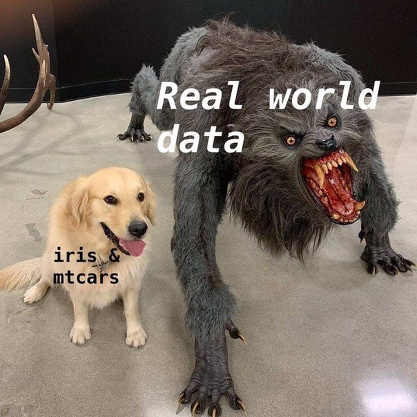

```{r setup, include=FALSE}
knitr::opts_chunk$set(echo = FALSE)
```

# Введение

## О себе

- Поздняков Иван

- Факультет психологии МГУ (2009 - 2014)

- Когнитивная магистратура НИУ ВШЭ (2014 - 2016) 

- Аспирант/стажер-исследователь Института Когнитивных Нейронаук ВШЭ

- В свободное время: Digital Humanities, преподавание

## Зачем курс

- R с нуля

- R-way 

- Практика на данных

- Rmarkdown, ggplot2

## Первый день: основы R


## Второй день: работа с данными 


## Второй день: работа с данными 


###Третий день

- Описательная статистика

- Визуализация данных

- RMarkdown

# День первый

---


---


---

<blockquote class="twitter-tweet" data-lang="en"><p lang="en" dir="ltr">Computer Programming To Be Officially Renamed “Googling Stack Overflow”<br><br>Source: <a href="http://t.co/xu7acfXvFF">http://t.co/xu7acfXvFF</a> <a href="http://t.co/iJ9k7aAVhd">pic.twitter.com/iJ9k7aAVhd</a></p>&mdash; Stack Exchange (@StackExchange) <a href="https://twitter.com/StackExchange/status/623139544276299776?ref_src=twsrc%5Etfw">July 20, 2015</a></blockquote> <script async src="https://platform.twitter.com/widgets.js" charset="utf-8"></script> 

---

<blockquote class="twitter-tweet" data-lang="en"><p lang="en" dir="ltr">Does anyone ever get good at R or do they just get good at googling how to do things in R</p>&mdash; 🔬🖤Lauren M. Seyler, Ph.D.❤️⚒ (@mousquemere) <a href="https://twitter.com/mousquemere/status/1125522375141883907?ref_src=twsrc%5Etfw">May 6, 2019</a></blockquote> <script async src="https://platform.twitter.com/widgets.js" charset="utf-8"></script> 

---

<blockquote class="twitter-tweet" data-lang="en"><p lang="en" dir="ltr">Indexing lists in <a href="https://twitter.com/hashtag/rstats?src=hash&amp;ref_src=twsrc%5Etfw">#rstats</a>. Inspired by the Residence Inn <a href="http://t.co/YQ6axb2w7t">pic.twitter.com/YQ6axb2w7t</a></p>&mdash; Hadley Wickham (@hadleywickham) <a href="https://twitter.com/hadleywickham/status/643381054758363136?ref_src=twsrc%5Etfw">September 14, 2015</a></blockquote> <script async src="https://platform.twitter.com/widgets.js" charset="utf-8"></script> 

---


#День второй

---


---
##"Широкий" формат

Студент |До курса по R     | После курса по R
--------|----------------  | ----------------
Маша    |70                | 63
Рома    |80                | 74
Антонина|86                | 71

##"Длинный" формат 

Студент |Время измерения   | Вес (кг)
--------|----------------  | ----------------
Маша    |До курса по R     | 70
Рома    |До курса по R     | 80
Антонина|До курса по R     | 86
Маша    |После курса по R  | 63
Рома    |После курса по R  | 74
Антонина|После курса по R  | 71

---

